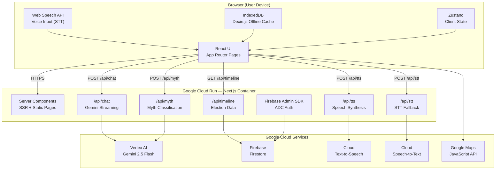

# ElectionDosti — Architecture

System design document for ElectionDosti, a multilingual AI-powered election education assistant deployed on Google Cloud Run.

---

## System Overview

ElectionDosti is a Next.js 14 application using the App Router pattern, deployed as a single Docker container on Google Cloud Run. The browser handles UI rendering, voice input (Web Speech API), and offline caching (IndexedDB). All AI inference, database access, and TTS synthesis happen server-side through Next.js API routes, ensuring secrets never reach the client.

---

## Architecture Diagram



### ASCII Fallback Diagram

```
+----------------------------------------------+
|              BROWSER (User Device)           |
|  React UI + Web Speech API + IndexedDB       |
+---------------------+------------------------+
                      | HTTPS
                      v
+----------------------------------------------+
|     GOOGLE CLOUD RUN — Next.js Container     |
|  +------------------------------------------+|
|  | Pages (SSR + Static)                     ||
|  | API Routes:                              ||
|  |   /api/chat  — Gemini streaming chat     ||
|  |   /api/myth  — Myth classification       ||
|  |   /api/tts   — Text-to-speech synthesis  ||
|  |   /api/stt   — Speech-to-text fallback   ||
|  |   /api/timeline — Election data query    ||
|  | Firebase Admin SDK (ADC credentials)     ||
|  +------------------------------------------+|
+---------+-----------+-----------+------------+
          |           |           |
          v           v           v
  +-------------+ +----------+ +-------------+
  | Vertex AI   | | Firebase | | Cloud TTS   |
  | Gemini 2.5  | | Firestore| | WaveNet     |
  | Flash       | |          | | Voices      |
  +-------------+ +----------+ +-------------+
```

---

## Tech Stack Rationale

| Choice | Reason |
|---|---|
| Next.js 14 App Router | Single deployment unit (one Docker image, one URL). Server Components keep API keys server-side. Built-in i18n routing. |
| Vertex AI Gemini 2.5 Flash | Fast inference with streaming support. Available via ADC on Cloud Run — no API key management. |
| Firebase Firestore | Schemaless NoSQL suits heterogeneous election data. Real-time listeners possible for future features. |
| Web Speech API | Free, instant (no network round trip), supports Hindi/Tamil/Telugu out of the box on Chrome/Edge. |
| Cloud TTS over browser SpeechSynthesis | Browser TTS quality for Indian languages is poor. WaveNet voices sound natural. |
| Dexie.js over raw IndexedDB | IndexedDB API is verbose. Dexie provides a clean Promise-based API in 24KB. |
| Zustand over Redux | 12KB vs 50KB+ — critical for rural users on 3G. Same DX without boilerplate. |
| `next-intl` over `react-i18next` | Integrates natively with App Router file-based routing via `[locale]` segment. |

---

## Request Lifecycle

Walk-through of a voice query: *"What is NOTA?"* spoken in Hindi.

```
1. BROWSER: Web Speech API captures audio, transcribes to Hindi text
2. BROWSER: Zustand store dispatches sendMessage("नोटा क्या है?", "hi")
3. BROWSER: fetch POST /api/chat with { message, language, history }
4. SERVER:  Zod schema validates request body
5. SERVER:  Intent router classifies → EDUCATION (keyword match: "NOTA")
6. SERVER:  Gemini 2.5 Flash called with education system prompt + user message
7. SERVER:  Response streamed back as text/plain via ReadableStream
8. BROWSER: Chat UI renders tokens as they arrive (word-by-word)
9. BROWSER: After stream completes, auto-calls /api/tts with response text
10. SERVER: Cloud TTS synthesizes Hindi WaveNet audio, returns MP3 blob
11. BROWSER: Audio element plays the response aloud
```

---

## Data Model

### Static Data (hardcoded for stability)

Education topics and election timeline data are currently embedded in page components for reliability. This avoids Firestore dependency for critical display content.

| Data | Location | Format |
|---|---|---|
| Education topics (10) | `app/[locale]/education/page.tsx` | TypeScript array of topic objects |
| Education content | `app/[locale]/education/[topicId]/page.tsx` | Switch-case content blocks |
| Timeline schedule | `app/[locale]/timeline/page.tsx` | TypeScript Record keyed by state |

### Firestore Collections (available for dynamic data)

| Collection | Schema | Access |
|---|---|---|
| `constituencies` | `{ nameEn, state, phase, pollDate, type }` | Read-only (Admin SDK writes) |
| `myths` | `{ claimEn, claimHi, verdict, explanation, sourceUrl, keywords[] }` | Read-only |

### Client-Side Cache (IndexedDB via Dexie)

| Table | Key | Purpose |
|---|---|---|
| `myths` | `mythId` | Offline myth lookup |
| `educationTopics` | `topicId` | Offline education content |
| `ttsAudio` | `hash` | Cached TTS audio blobs |

---

## Module Boundaries

```
ElectionDosti/
├── app/                        # Next.js routing and pages
│   ├── [locale]/               # All user-facing pages (i18n)
│   └── api/                    # Server-side API routes (no UI)
├── components/                 # Reusable React components
│   ├── ui/                     # shadcn/ui primitives (Button, Card, etc.)
│   ├── chat/                   # Chat-specific components
│   ├── myth/                   # Myth buster components
│   ├── booth/                  # Map and booth components
│   └── education/              # Education card components
├── lib/                        # Shared non-UI logic
│   ├── ai/                     # Gemini client, prompts, intent router
│   │   ├── gemini.ts           # VertexAI wrapper (lazy init, streaming)
│   │   ├── prompts.ts          # System prompts per module
│   │   └── intent-router.ts    # Keyword-based intent classifier
│   ├── firebase/               # Firebase Admin (ADC) + client init
│   │   ├── admin.ts            # Server-side admin SDK
│   │   └── client.ts           # Browser-side Firebase init
│   ├── voice/                  # Voice I/O utilities
│   │   ├── speech-recognition.ts  # Web Speech API wrapper
│   │   └── tts-client.ts       # Calls /api/tts, plays audio
│   ├── db/dexie.ts             # IndexedDB schema and singleton
│   ├── store/                  # Zustand state stores
│   └── types/                  # TypeScript interfaces
├── Dockerfile                  # Multi-stage production build
├── cloudbuild.yaml             # Cloud Build pipeline config
└── firestore.rules             # Firestore security rules
```

**Ownership rules:**
- `app/api/*` — server-only code. May import from `lib/ai/`, `lib/firebase/`. Never imports from `components/`.
- `components/*` — client-only UI. May import from `lib/store/`, `lib/voice/`, `lib/db/`. Never imports from `lib/firebase/admin.ts`.
- `lib/ai/*` — server-only. Imported exclusively by API routes.
- `lib/voice/*` — browser-only. Uses `'use client'` paradigm.

---

## Key Design Decisions

1. **Server-side AI only** — All Gemini calls happen in API routes (`/api/chat`, `/api/myth`). This prevents API key leakage and enables streaming via `ReadableStream`. Browser components never import `@google-cloud/vertexai`.

2. **Application Default Credentials (ADC)** — Cloud Run provides automatic credentials via its service account. No `firebase-sa.json` file in the Docker image. See [SECURITY.md](./SECURITY.md) for details.

3. **Keyword-based intent fallback** — The intent router uses a local keyword classifier before attempting Gemini classification. This ensures the chat remains functional even if the AI service is temporarily unavailable.

4. **Static data for critical content** — Education topics and election timeline are embedded in TypeScript rather than fetched from Firestore. This eliminates a runtime dependency and ensures the app works even if Firestore is empty or unreachable.

5. **Single-container deployment** — The entire app (frontend + API routes) ships as one Docker image to Cloud Run. This simplifies deployment, monitoring, and cost management compared to a microservices approach.
